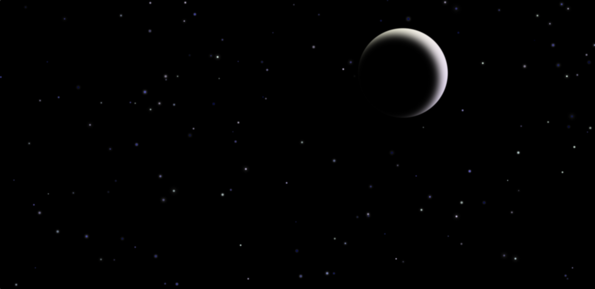

# Ceu Estrelado

Este projeto cria uma animação de céu estrelado com uma meia-lua e estrelas cintilantes, utilizando HTML, CSS e JavaScript. A animação simula um céu noturno, onde as estrelas brilham, piscam e mudam de cor, criando uma atmosfera relaxante e visualmente interessante.

## Visão Geral

- **HTML**: Estrutura a página com um contêiner para as estrelas e a meia-lua.
- **CSS**: Estiliza a página, criando a animação do céu, das estrelas e da meia-lua. Inclui efeitos de brilho, cintilação e mudança de cor nas estrelas.
- **JavaScript**: Gera dinamicamente as estrelas na tela e aplica animações e efeitos aleatórios para cada uma delas.

## Funcionalidades

- **Meia-lua**: Um elemento estilizado que aparece na parte superior do céu com um efeito de desfoque.
- **Estrelas**: Um total de 150 estrelas que aparecem aleatoriamente na tela, com animações de cintilação, brilho e mudança de cor.
- **Animações**: As estrelas possuem animações que variam em tempo e intensidade, criando um efeito dinâmico.

## Como Funciona

1. **Meia-lua**: Uma meia-lua é posicionada no topo da tela, com um efeito de desfoque aplicado para dar um aspecto suave.
2. **Geração de Estrelas**: As estrelas são criadas dinamicamente via JavaScript. Para cada estrela, são definidos:
   - **Posição aleatória**: As estrelas são distribuídas por toda a tela.
   - **Tamanho aleatório**: As estrelas têm tamanhos variados.
   - **Animações aleatórias**: A cada estrela é aplicada uma animação com diferentes tempos e efeitos de brilho e cor.
3. **Animações CSS**:
   - **Cintilação**: As estrelas piscam com variação de opacidade.
   - **Brilho**: As estrelas mudam de tamanho e intensidade de brilho.
   - **Mudança de cor**: As estrelas alternam entre diferentes cores, criando uma aparência dinâmica.

## Instalação

1. Clone ou baixe este repositório para o seu computador.
2. Abra o arquivo `index.html` em seu navegador para visualizar a animação do céu estrelado.

## Personalização

- **Número de estrelas**: O número de estrelas pode ser ajustado alterando o valor de `numEstrelas` na função `ceuEstrelado()`.
- **Tamanhos das estrelas**: Modifique a fórmula de `tamanho` dentro da função `ceuEstrelado()` para alterar o tamanho das estrelas.
- **Tempo de animação**: Você pode ajustar os tempos de animação das estrelas no CSS, alterando as propriedades de `@keyframes` e o JavaScript.

## Tecnologias Utilizadas

- **HTML5**
- **CSS3**
- **JavaScript**
